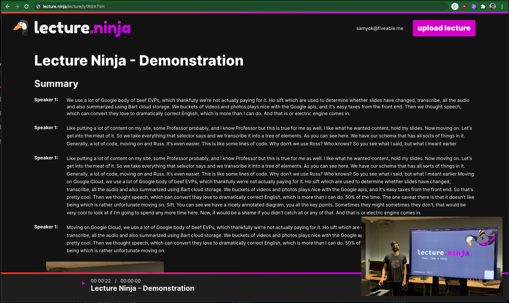

# Lecture Ninja
[Hackathon Demo/DevPost](https://devpost.com/software/lecture-ninja)

## Inspiration
- Trying to watch a lecture without captions in a public space

## What it does
Lecture Ninja takes your video files and converts it into an accessible document by:
1. Transcribing speech in the video
2. Detecting when someone switches slides on a PowerPoint in the video, and extracting slides to show as figures
   In addition, Lecture Ninja also has the following features:
1. Clicking any word within the document brings you to when that word was said in the video
2. Creates **headings** for you for organization purposes and ease of reading
3. Generates a **summary** for each video

## How we built it
**Frontend**:
The frontend was built using Next.js as a framework for React (routing) with JavaScript. For the UI, we also created components (modals, cards, etc.) using Material UI and custom CSS.

**Backend**:
The backend consists of two microservices. One microservice -- written in JavaScript using Node and Express, handles the CRUD operations (e.g adding new videos, handling user login, etc). It depends on our second microservice -- written in Python using FastAPI, OpenCV, ffmpeg, and the Google Cloud API Client. This second microservice is responsible for handling speech-to-text and slide change detection from the video.

Our implementation of slide change detection is based on the algorithm described in this paper:

    Jeong, H. J., Kim, T.-E., Kim, H. G., & Kim, M. H. (2015). Automatic detection of slide transitions in lecture videos. Multimedia Tools and Applications, 74(18), 7537–7554. https://doi.org/10.1007/s11042-014-1990-6

## Challenges we ran into
Only testing the Jeong et al algorithm on one video led to a fragile implementation, which caused problems when we wanted to implemented it on other videos
slept too much

## Accomplishments that we're proud of
We were able to quickly and effectively implement an algorithm that was described in a research paper.

## What we learned
- We learned how SIFT feature matching can be used to robustly match things across 2 images
  SIFT stands for “Scale-Invariant Feature Transform”. When applied to an image, the SIFT algorithm extracts keypoints (representing points in the image that are distinctive) and descriptors (vector representations of the detected features).
- We can compare descriptors between two images in order to see if the same slide is in both images. Using the SIFT algorithm means that we can handle a handheld video recording of a speaker presenting their slides, which is a lot nosier compared to a Zoom presentation where the presenter is screen sharing their slides.
- We also learned about how to make multiple services coordinate manipulation of large files

## Future Updates
- Use machine learning for more robust slide change detection
- Allow **editing** in generated documents in case the user wants to add notes or corrections
- Allow the video thumbnail in documents to be **minimized** and/or moved
- **Delete Lecture** feature on the dashboard
- More geese
